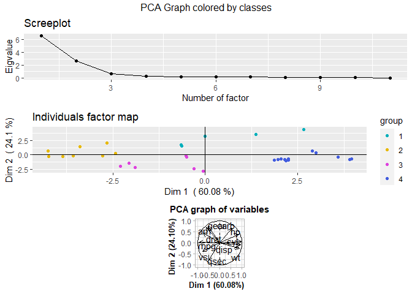
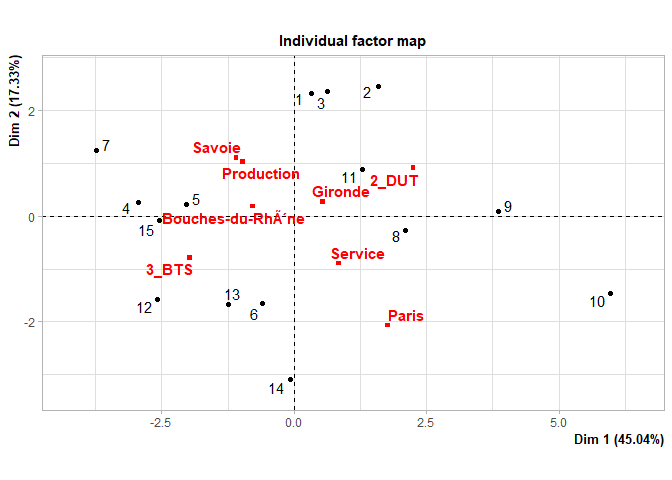

This vignette gives a high level overview on how to use the clustyanaly
R package

    library(clustyanaly)

Use clustyanaly index
---------------------

We will show you how we can use internal index from the package

    data("iris")
    df <- iris
    head(df, 3)

    ##   Sepal.Length Sepal.Width Petal.Length Petal.Width Species
    ## 1          5.1         3.5          1.4         0.2  setosa
    ## 2          4.9         3.0          1.4         0.2  setosa
    ## 3          4.7         3.2          1.3         0.2  setosa

We will use iris data and we predict a kmean with cluster = 5 parameter
must be a data frame and vector

    fit <- kmeans(scale(df[, -5]), 5)
    clust <- fit$cluster
    clust <- as.vector(clust)
    df <- as.data.frame(scale(df[, -5]))

Silhouette index
----------------

You can evaluate the silhouette index for each point of the data frame,
cluster and general Value are beetween -1 and 1

    silhouette(df,clust)

    ## $s_coeff
    ## [1] 0.4114309
    ## 
    ## $vect_point
    ##           1           5           7           8          11          12 
    ##  0.62134250  0.59532977  0.15801869  0.46813474  0.18644128  0.32917875 
    ##          18          20          21          22          23          24 
    ##  0.62734198  0.11102438  0.47392274  0.38261038  0.39981257  0.24250793 
    ##          25          27          28          29          32          37 
    ##  0.30924917  0.46132887  0.62163714  0.50750855  0.47599170  0.46414447 
    ##          38          40          41          44          45          47 
    ##  0.56850876  0.50294128  0.59724217  0.50092074  0.08959062  0.11656864 
    ##          49          50           2           3           4           9 
    ##  0.27936118  0.15221131  0.58668457  0.42578202  0.59370380  0.58157993 
    ##          10          13          14          26          30          31 
    ##  0.51506784  0.61248767  0.54588543  0.51820762  0.41362302  0.56505337 
    ##          35          36          39          42          43          46 
    ##  0.52458736  0.20132656  0.59265398  0.36650310  0.42183502  0.59972173 
    ##          48           6          15          16          17          19 
    ##  0.44795165  0.36205463  0.52313259  0.51541753  0.36720357  0.24382522 
    ##          33          34          51          52          53          57 
    ##  0.46088472  0.59107158  0.34169992  0.16627565  0.35854546  0.23206569 
    ##          66          71          76          77          78          86 
    ##  0.18906699  0.03645185  0.05112346  0.04063911  0.34222491  0.10973108 
    ##          87         101         103         104         105         106 
    ##  0.27953553  0.42463909  0.52207700  0.15132973  0.43894193  0.47218801 
    ##         108         109         110         111         112         113 
    ##  0.44360797  0.01675919  0.46637587  0.44615652 -0.01058434  0.50147349 
    ##         116         117         118         119         121         123 
    ##  0.44552087  0.35179075  0.41131991  0.33087257  0.54976242  0.40083606 
    ##         125         126         128         129         130         131 
    ##  0.52568825  0.51433621 -0.02489394  0.22253544  0.43638496  0.41286324 
    ##         132         133         136         137         138         140 
    ##  0.39874279  0.24284231  0.46884592  0.42243015  0.36093602  0.53818328 
    ##         141         142         144         145         146         148 
    ##  0.50861824  0.51142970  0.54298088  0.50444897  0.46228025  0.38121152 
    ##         149          54          55          56          58          59 
    ##  0.38714414  0.54373992  0.13270610  0.53878741  0.22621135  0.03768897 
    ##          60          61          62          63          64          65 
    ##  0.51839547  0.27707945  0.34088756  0.46946550  0.33187646  0.49517920 
    ##          67          68          69          70          72          73 
    ##  0.39249659  0.54918014  0.40350566  0.57558758  0.45853055  0.36638600 
    ##          74          75          79          80          81          82 
    ##  0.42610282  0.21912232  0.37447730  0.50781379  0.53012272  0.48890039 
    ##          83          84          85          88          89          90 
    ##  0.56859072  0.39023598  0.40497788  0.41829609  0.44045285  0.58629734 
    ##          91          92          93          94          95          96 
    ##  0.58416837  0.24125752  0.58008127  0.27393126  0.58397553  0.43067583 
    ##          97          98          99         100         102         107 
    ##  0.50035119  0.33948876  0.26805208  0.55292391  0.34345454  0.47007943 
    ##         114         115         120         122         124         127 
    ##  0.37966719  0.05778708  0.41625797  0.31780905  0.17744927  0.17430033 
    ##         134         135         139         143         147         150 
    ##  0.19544119  0.34505079  0.08594176  0.34345454  0.22992489  0.09788140 
    ## 
    ## $vect_clust
    ##         1         3         2         4         5 
    ## 0.3939566 0.5007444 0.4376557 0.3473922 0.3774056

You can also choose a distance

    silhouette(df,clust,"manhattan")

    ## $s_coeff
    ## [1] 0.4053886
    ## 
    ## $vect_point
    ##            1            5            7            8           11           12 
    ##  0.594702623  0.567200097  0.113963385  0.461003549  0.126948839  0.261731435 
    ##           18           20           21           22           23           24 
    ##  0.599908688  0.163130839  0.484273862  0.370137172  0.253020719  0.294394266 
    ##           25           27           28           29           32           37 
    ##  0.250946946  0.471607071  0.600997323  0.505399861  0.469504029  0.383898989 
    ##           38           40           41           44           45           47 
    ##  0.450105091  0.519250598  0.535809227  0.498030902  0.104879405  0.196839800 
    ##           49           50            2            3            4            9 
    ##  0.249131034  0.139364523  0.564555366  0.464271079  0.596353308  0.589805890 
    ##           10           13           14           26           30           31 
    ##  0.469285115  0.592347654  0.563441655  0.449446838  0.422934701  0.532227264 
    ##           35           36           39           42           43           46 
    ##  0.487596240  0.205579586  0.631247642  0.375899341  0.487249357  0.562201538 
    ##           48            6           15           16           17           19 
    ##  0.482058890  0.350102418  0.488003571  0.505778988  0.360097276  0.256875416 
    ##           33           34           51           52           53           57 
    ##  0.304707540  0.516231474  0.284553611  0.090771856  0.319545894  0.156295530 
    ##           66           71           76           77           78           86 
    ##  0.119494217  0.016703638 -0.031278681 -0.051564168  0.335822791 -0.057145368 
    ##           87          101          103          104          105          106 
    ##  0.236328082  0.463044922  0.554893704  0.215308039  0.499536268  0.502638267 
    ##          108          109          110          111          112          113 
    ##  0.436306260  0.153130556  0.511242033  0.464637066  0.076223555  0.538569976 
    ##          116          117          118          119          121          123 
    ##  0.487161044  0.400050065  0.459321917  0.333389887  0.594384602  0.393851100 
    ##          125          126          128          129          130          131 
    ##  0.573673198  0.546323928 -0.004046125  0.297777899  0.441648625  0.405837702 
    ##          132          133          136          137          138          140 
    ##  0.440023470  0.313252887  0.516662696  0.453632577  0.412255740  0.567100799 
    ##          141          142          144          145          146          148 
    ##  0.557419583  0.536416406  0.591409667  0.550755540  0.498459361  0.411172872 
    ##          149           54           55           56           58           59 
    ##  0.407931117  0.596098400  0.175505178  0.577291896  0.220629859  0.121030205 
    ##           60           61           62           63           64           65 
    ##  0.569072967  0.270648700  0.381595770  0.527590917  0.359160904  0.539402506 
    ##           67           68           69           70           72           73 
    ##  0.412859964  0.591950279  0.427707139  0.617689952  0.514510029  0.359872848 
    ##           74           75           79           80           81           82 
    ##  0.462094768  0.286819436  0.401716073  0.559519392  0.579613012  0.534049134 
    ##           83           84           85           88           89           90 
    ##  0.607804348  0.366614862  0.408037473  0.459811205  0.491579024  0.624549355 
    ##           91           92           93           94           95           96 
    ##  0.614776765  0.282634120  0.618598804  0.261485317  0.621983986  0.484265999 
    ##           97           98           99          100          102          107 
    ##  0.547296564  0.398864058  0.291287588  0.595446387  0.303072775  0.470532547 
    ##          114          115          120          122          124          127 
    ##  0.353733488  0.072670690  0.428997644  0.284737067  0.137797580  0.153872199 
    ##          134          135          139          143          147          150 
    ##  0.187022304  0.325465975  0.064598746  0.303072775  0.156289704  0.037782902 
    ## 
    ## $vect_clust
    ##         1         3         2         4         5 
    ## 0.3717762 0.4986177 0.3973995 0.3621473 0.3970021

Davies bouldin index
--------------------

You can evaluate the Davies\_bouldin index the lower the value, the
better is the clustering

    davies_bouldin(df,clust)

    ## $davies_bouldin
    ## [1] 0.8195665

You can also choose a distance

    davies_bouldin(df,clust,"maximum")

    ## $davies_bouldin
    ## [1] 0.8719598

Dunn index
----------

You can evaluate the Dunn index the higher the value, the better is the
clustering You have different evaluation of Dunn in function of the
distance beetwenn cluster(mean,max,min)

    dunn(df,clust)

    ## $dunn_mean
    ## [1] 0.3615745
    ## 
    ## $dunn_min
    ## [1] 0.0398931
    ## 
    ## $dunn_max
    ## [1] 0.4370565

You can also choose a distance

    dunn(df,clust,"canberra")

    ## $dunn_mean
    ## [1] 0.2044571
    ## 
    ## $dunn_min
    ## [1] 0.07382948
    ## 
    ## $dunn_max
    ## [1] 0.2880811

Variance index
--------------

You can evaluate different variance index like calinski\_harabasz
coefficient, Ball\_hall coefficient, Hartigan coefficient and Xu
coefficient.

    variance_index(df,clust)

    ## $calinski_harabasz
    ## [1] 170.6889
    ## 
    ## $ball_hall
    ## [1] 0.5295061
    ## 
    ## $Hartigan
    ## [1] 1.549403
    ## 
    ## $Xu
    ## [1] -19.25844

Example with Davies Bouldin index
---------------------------------

We can find the best number cluster for our model with Davies Bouldin
index for example

    fit <- kmeans(scale(df[, -5]), 5)
    clust <- fit$cluster
    clust <- as.vector(clust)
    df <- as.data.frame(scale(df[, -5]))
    DB_id <- c()
    for (k in 2:20){
      fit <- kmeans(scale(df[, -5]), k)
      clust <- fit$cluster
      clust <- as.vector(clust)
      DB_id <- append(DB_id ,davies_bouldin(df,clust))
    }
    cluster_number <- c(2:20)
    plot(cluster_number,DB_id)  

Tutorial for univariate and multivariate characterization
---------------------------------------------------------

We are going to graphically represent three datasets. We take for this
tutorial a data frame with quantitative variable “mtcars”, a data frame
with qualitative variable “canine” and finally a data frame with both
type of data “small\_apb”.

Load data :

The data frame “canines” and “small\_apb” have already a column with the
class value of individuals. It’s the last column of the data frame.

Load the canines data :

    #group variable :
    groupe_canines<-canines[8]
    #analysis variables
    df_canines<-canines[c(-1,-8)]
    rownames(df_canines)<-canines[,1]

Load the small\_apb data :

    #group variable :
    apb_groupe<-small_apb[,length(small_apb)]
    #analysis variables
    apb<-small_apb[c(-1,-length(small_apb))]

The data frame “mtcars” does not have columns representing groups of
individuals. We are therefore going to make a hierarchical ascending
classification (hac) to create groups.

Load the mtcars data:

    #center and reduce data
    mtcars.cr <- scale(mtcars,center=T,scale=T)
    #calculating of distance
    d.mtcars <- dist(mtcars.cr)
    #hierarchical ascending classification with method ward
    cah.ward2 <- hclust(d.mtcars,method="ward.D2")

    #group variable with 4 class:
    groupes.cah2 <- cutree(cah.ward2,k=4)
    #analysis variables : mtcars

Creation of type ‘ClusteringData’ :
-----------------------------------

Thanks to the function “data\_manager()”, we can create an object of
class ‘ClusteringData’. This object allows you to simply use the other
functions accessible from the package.

    #for canine data
    canine_objet<-data_manager(df_canines,groupe_canines)
    #for mtcars data
    cars<-data_manager(mtcars,groupes.cah2)
    #for small_apb data
    apb_objet<-data_manager(apb,apb_groupe)

Display data graphs univariate
------------------------------

Display data graphs univariate by data type (quantitative or qualitative
variables). If the data has both types of data, all graphs are
displayed, else only the corresponding graphs are displayed.

For qualitative data :

    #for canine data
    get_graph_car_univ(canine_objet)

    ## [1] "Table for variable : "
    ## [1] "Taille"
    ## [1] "Contingency table"
    ## Margins computed over dimensions
    ## in the following order:
    ## 1: groupe
    ## 2: 
    ##        
    ## groupe  Taille- Taille+ Taille++ Total
    ##   1           0       2        9    11
    ##   2           1       0        5     6
    ##   3           6       3        1    10
    ##   Total       7       5       15    27
    ## [1] "Row profiles table"
    ##        
    ## groupe  Taille- Taille+ Taille++  Total
    ##   1        0.00   18.18    81.82 100.00
    ##   2       16.67    0.00    83.33 100.00
    ##   3       60.00   30.00    10.00 100.00
    ##   Total   25.93   18.52    55.56 100.01
    ## [1] "Column profiles table"
    ##        
    ## groupe  Taille- Taille+ Taille++  Total
    ##   1        0.00   40.00    60.00  40.74
    ##   2       14.29    0.00    33.33  22.22
    ##   3       85.71   60.00     6.67  37.04
    ##   Total  100.00  100.00   100.00 100.00
    ## [1] "Table for variable : "
    ## [1] "Poids"
    ## [1] "Contingency table"
    ## Margins computed over dimensions
    ## in the following order:
    ## 1: groupe
    ## 2: 
    ##        
    ## groupe  Poids- Poids+ Poids++ Total
    ##   1          0     10       1    11
    ##   2          1      1       4     6
    ##   3          7      3       0    10
    ##   Total      8     14       5    27
    ## [1] "Row profiles table"
    ##        
    ## groupe  Poids- Poids+ Poids++  Total
    ##   1       0.00  90.91    9.09 100.00
    ##   2      16.67  16.67   66.67 100.01
    ##   3      70.00  30.00    0.00 100.00
    ##   Total  29.63  51.85   18.52 100.00
    ## [1] "Column profiles table"
    ##        
    ## groupe  Poids- Poids+ Poids++  Total
    ##   1       0.00  71.43   20.00  40.74
    ##   2      12.50   7.14   80.00  22.22
    ##   3      87.50  21.43    0.00  37.04
    ##   Total 100.00 100.00  100.00 100.00
    ## [1] "Table for variable : "
    ## [1] "Velocite"
    ## [1] "Contingency table"
    ## Margins computed over dimensions
    ## in the following order:
    ## 1: groupe
    ## 2: 
    ##        
    ## groupe  Veloc- Veloc+ Veloc++ Total
    ##   1          1      4       6    11
    ##   2          4      0       2     6
    ##   3          5      4       1    10
    ##   Total     10      8       9    27
    ## [1] "Row profiles table"
    ##        
    ## groupe  Veloc- Veloc+ Veloc++  Total
    ##   1       9.09  36.36   54.55 100.00
    ##   2      66.67   0.00   33.33 100.00
    ##   3      50.00  40.00   10.00 100.00
    ##   Total  37.04  29.63   33.33 100.00
    ## [1] "Column profiles table"
    ##        
    ## groupe  Veloc- Veloc+ Veloc++  Total
    ##   1      10.00  50.00   66.67  40.74
    ##   2      40.00   0.00   22.22  22.22
    ##   3      50.00  50.00   11.11  37.04
    ##   Total 100.00 100.00  100.00 100.00
    ## [1] "Table for variable : "
    ## [1] "Intelligence"
    ## [1] "Contingency table"
    ## Margins computed over dimensions
    ## in the following order:
    ## 1: groupe
    ## 2: 
    ##        
    ## groupe  Intell- Intell+ Intell++ Total
    ##   1           3       4        4    11
    ##   2           3       2        1     6
    ##   3           2       7        1    10
    ##   Total       8      13        6    27
    ## [1] "Row profiles table"
    ##        
    ## groupe  Intell- Intell+ Intell++  Total
    ##   1       27.27   36.36    36.36  99.99
    ##   2       50.00   33.33    16.67 100.00
    ##   3       20.00   70.00    10.00 100.00
    ##   Total   29.63   48.15    22.22 100.00
    ## [1] "Column profiles table"
    ##        
    ## groupe  Intell- Intell+ Intell++  Total
    ##   1       37.50   30.77    66.67  40.74
    ##   2       37.50   15.38    16.67  22.22
    ##   3       25.00   53.85    16.67  37.04
    ##   Total  100.00  100.00   100.01 100.00
    ## [1] "Table for variable : "
    ## [1] "Affection"
    ## [1] "Contingency table"
    ## Margins computed over dimensions
    ## in the following order:
    ## 1: groupe
    ## 2: 
    ##        
    ## groupe  Affec- Affec+ Total
    ##   1          7      4    11
    ##   2          6      0     6
    ##   3          0     10    10
    ##   Total     13     14    27
    ## [1] "Row profiles table"
    ##        
    ## groupe  Affec- Affec+  Total
    ##   1      63.64  36.36 100.00
    ##   2     100.00   0.00 100.00
    ##   3       0.00 100.00 100.00
    ##   Total  48.15  51.85 100.00
    ## [1] "Column profiles table"
    ##        
    ## groupe  Affec- Affec+  Total
    ##   1      53.85  28.57  40.74
    ##   2      46.15   0.00  22.22
    ##   3       0.00  71.43  37.04
    ##   Total 100.00 100.00 100.00
    ## [1] "Table for variable : "
    ## [1] "Agressivite"
    ## [1] "Contingency table"
    ## Margins computed over dimensions
    ## in the following order:
    ## 1: groupe
    ## 2: 
    ##        
    ## groupe  Agress- Agress+ Total
    ##   1           6       5    11
    ##   2           1       5     6
    ##   3           7       3    10
    ##   Total      14      13    27
    ## [1] "Row profiles table"
    ##        
    ## groupe  Agress- Agress+  Total
    ##   1       54.55   45.45 100.00
    ##   2       16.67   83.33 100.00
    ##   3       70.00   30.00 100.00
    ##   Total   51.85   48.15 100.00
    ## [1] "Column profiles table"
    ##        
    ## groupe  Agress- Agress+  Total
    ##   1       42.86   38.46  40.74
    ##   2        7.14   38.46  22.22
    ##   3       50.00   23.08  37.04
    ##   Total  100.00  100.00 100.00
    ## [1] "Table for variable : "
    ## [1] "Taille"
    ## [1] "Contingency table"
    ## Margins computed over dimensions
    ## in the following order:
    ## 1: groupe
    ## 2: 
    ##        
    ## groupe  Taille- Taille+ Taille++ Total
    ##   1           0       2        9    11
    ##   2           1       0        5     6
    ##   3           6       3        1    10
    ##   Total       7       5       15    27
    ## [1] "Row profiles table"
    ##        
    ## groupe  Taille- Taille+ Taille++  Total
    ##   1        0.00   18.18    81.82 100.00
    ##   2       16.67    0.00    83.33 100.00
    ##   3       60.00   30.00    10.00 100.00
    ##   Total   25.93   18.52    55.56 100.01
    ## [1] "Column profiles table"
    ##        
    ## groupe  Taille- Taille+ Taille++  Total
    ##   1        0.00   40.00    60.00  40.74
    ##   2       14.29    0.00    33.33  22.22
    ##   3       85.71   60.00     6.67  37.04
    ##   Total  100.00  100.00   100.00 100.00
    ## [1] "Table for variable : "
    ## [1] "Poids"
    ## [1] "Contingency table"
    ## Margins computed over dimensions
    ## in the following order:
    ## 1: groupe
    ## 2: 
    ##        
    ## groupe  Poids- Poids+ Poids++ Total
    ##   1          0     10       1    11
    ##   2          1      1       4     6
    ##   3          7      3       0    10
    ##   Total      8     14       5    27
    ## [1] "Row profiles table"
    ##        
    ## groupe  Poids- Poids+ Poids++  Total
    ##   1       0.00  90.91    9.09 100.00
    ##   2      16.67  16.67   66.67 100.01
    ##   3      70.00  30.00    0.00 100.00
    ##   Total  29.63  51.85   18.52 100.00
    ## [1] "Column profiles table"
    ##        
    ## groupe  Poids- Poids+ Poids++  Total
    ##   1       0.00  71.43   20.00  40.74
    ##   2      12.50   7.14   80.00  22.22
    ##   3      87.50  21.43    0.00  37.04
    ##   Total 100.00 100.00  100.00 100.00
    ## [1] "Table for variable : "
    ## [1] "Velocite"
    ## [1] "Contingency table"
    ## Margins computed over dimensions
    ## in the following order:
    ## 1: groupe
    ## 2: 
    ##        
    ## groupe  Veloc- Veloc+ Veloc++ Total
    ##   1          1      4       6    11
    ##   2          4      0       2     6
    ##   3          5      4       1    10
    ##   Total     10      8       9    27
    ## [1] "Row profiles table"
    ##        
    ## groupe  Veloc- Veloc+ Veloc++  Total
    ##   1       9.09  36.36   54.55 100.00
    ##   2      66.67   0.00   33.33 100.00
    ##   3      50.00  40.00   10.00 100.00
    ##   Total  37.04  29.63   33.33 100.00
    ## [1] "Column profiles table"
    ##        
    ## groupe  Veloc- Veloc+ Veloc++  Total
    ##   1      10.00  50.00   66.67  40.74
    ##   2      40.00   0.00   22.22  22.22
    ##   3      50.00  50.00   11.11  37.04
    ##   Total 100.00 100.00  100.00 100.00
    ## [1] "Table for variable : "
    ## [1] "Intelligence"
    ## [1] "Contingency table"
    ## Margins computed over dimensions
    ## in the following order:
    ## 1: groupe
    ## 2: 
    ##        
    ## groupe  Intell- Intell+ Intell++ Total
    ##   1           3       4        4    11
    ##   2           3       2        1     6
    ##   3           2       7        1    10
    ##   Total       8      13        6    27
    ## [1] "Row profiles table"
    ##        
    ## groupe  Intell- Intell+ Intell++  Total
    ##   1       27.27   36.36    36.36  99.99
    ##   2       50.00   33.33    16.67 100.00
    ##   3       20.00   70.00    10.00 100.00
    ##   Total   29.63   48.15    22.22 100.00
    ## [1] "Column profiles table"
    ##        
    ## groupe  Intell- Intell+ Intell++  Total
    ##   1       37.50   30.77    66.67  40.74
    ##   2       37.50   15.38    16.67  22.22
    ##   3       25.00   53.85    16.67  37.04
    ##   Total  100.00  100.00   100.01 100.00
    ## [1] "Table for variable : "
    ## [1] "Affection"
    ## [1] "Contingency table"
    ## Margins computed over dimensions
    ## in the following order:
    ## 1: groupe
    ## 2: 
    ##        
    ## groupe  Affec- Affec+ Total
    ##   1          7      4    11
    ##   2          6      0     6
    ##   3          0     10    10
    ##   Total     13     14    27
    ## [1] "Row profiles table"
    ##        
    ## groupe  Affec- Affec+  Total
    ##   1      63.64  36.36 100.00
    ##   2     100.00   0.00 100.00
    ##   3       0.00 100.00 100.00
    ##   Total  48.15  51.85 100.00
    ## [1] "Column profiles table"
    ##        
    ## groupe  Affec- Affec+  Total
    ##   1      53.85  28.57  40.74
    ##   2      46.15   0.00  22.22
    ##   3       0.00  71.43  37.04
    ##   Total 100.00 100.00 100.00
    ## [1] "Table for variable : "
    ## [1] "Agressivite"
    ## [1] "Contingency table"
    ## Margins computed over dimensions
    ## in the following order:
    ## 1: groupe
    ## 2: 
    ##        
    ## groupe  Agress- Agress+ Total
    ##   1           6       5    11
    ##   2           1       5     6
    ##   3           7       3    10
    ##   Total      14      13    27
    ## [1] "Row profiles table"
    ##        
    ## groupe  Agress- Agress+  Total
    ##   1       54.55   45.45 100.00
    ##   2       16.67   83.33 100.00
    ##   3       70.00   30.00 100.00
    ##   Total   51.85   48.15 100.00
    ## [1] "Column profiles table"
    ##        
    ## groupe  Agress- Agress+  Total
    ##   1       42.86   38.46  40.74
    ##   2        7.14   38.46  22.22
    ##   3       50.00   23.08  37.04
    ##   Total  100.00  100.00 100.00

For quantitative data :

    #for mtcars data
    get_graph_car_univ(cars)

For mixed data :

    #For small_apb data
    get_graph_car_univ(apb_objet)

    ## [1] "Table for variable : "
    ## [1] "ï..Departement"
    ## [1] "Contingency table"
    ## Margins computed over dimensions
    ## in the following order:
    ## 1: groupe
    ## 2: 
    ##        
    ## groupe  Bouches-du-Rhône Gironde Paris Savoie Total
    ##   1                     2       1     0      2     5
    ##   2                     2       2     0      2     6
    ##   3                     0       0     2      0     2
    ##   4                     0       1     1      0     2
    ##   Total                 4       4     3      4    15
    ## [1] "Row profiles table"
    ##        
    ## groupe  Bouches-du-Rhône Gironde  Paris Savoie  Total
    ##   1                 40.00   20.00   0.00  40.00 100.00
    ##   2                 33.33   33.33   0.00  33.33  99.99
    ##   3                  0.00    0.00 100.00   0.00 100.00
    ##   4                  0.00   50.00  50.00   0.00 100.00
    ##   Total             26.67   26.67  20.00  26.67 100.01
    ## [1] "Column profiles table"
    ##        
    ## groupe  Bouches-du-Rhône Gironde  Paris Savoie  Total
    ##   1                 50.00   25.00   0.00  50.00  33.33
    ##   2                 50.00   50.00   0.00  50.00  40.00
    ##   3                  0.00    0.00  66.67   0.00  13.33
    ##   4                  0.00   25.00  33.33   0.00  13.33
    ##   Total            100.00  100.00 100.00 100.00  99.99
    ## [1] "Table for variable : "
    ## [1] "Type_filieres"
    ## [1] "Contingency table"
    ## Margins computed over dimensions
    ## in the following order:
    ## 1: groupe
    ## 2: 
    ##        
    ## groupe  2_DUT 3_BTS Total
    ##   1         5     0     5
    ##   2         0     6     6
    ##   3         0     2     2
    ##   4         2     0     2
    ##   Total     7     8    15
    ## [1] "Row profiles table"
    ##        
    ## groupe   2_DUT  3_BTS  Total
    ##   1     100.00   0.00 100.00
    ##   2       0.00 100.00 100.00
    ##   3       0.00 100.00 100.00
    ##   4     100.00   0.00 100.00
    ##   Total  46.67  53.33 100.00
    ## [1] "Column profiles table"
    ##        
    ## groupe   2_DUT  3_BTS  Total
    ##   1      71.43   0.00  33.33
    ##   2       0.00  75.00  40.00
    ##   3       0.00  25.00  13.33
    ##   4      28.57   0.00  13.33
    ##   Total 100.00 100.00  99.99
    ## [1] "Table for variable : "
    ## [1] "Filiere"
    ## [1] "Contingency table"
    ## Margins computed over dimensions
    ## in the following order:
    ## 1: groupe
    ## 2: 
    ##        
    ## groupe  Production Service Total
    ##   1              3       2     5
    ##   2              3       3     6
    ##   3              1       1     2
    ##   4              0       2     2
    ##   Total          7       8    15
    ## [1] "Row profiles table"
    ##        
    ## groupe  Production Service  Total
    ##   1          60.00   40.00 100.00
    ##   2          50.00   50.00 100.00
    ##   3          50.00   50.00 100.00
    ##   4           0.00  100.00 100.00
    ##   Total      46.67   53.33 100.00
    ## [1] "Column profiles table"
    ##        
    ## groupe  Production Service  Total
    ##   1          42.86   25.00  33.33
    ##   2          42.86   37.50  40.00
    ##   3          14.29   12.50  13.33
    ##   4           0.00   25.00  13.33
    ##   Total     100.01  100.00  99.99
    ## [1] "Table for variable : "
    ## [1] "ï..Departement"
    ## [1] "Contingency table"
    ## Margins computed over dimensions
    ## in the following order:
    ## 1: groupe
    ## 2: 
    ##        
    ## groupe  Bouches-du-Rhône Gironde Paris Savoie Total
    ##   1                     2       1     0      2     5
    ##   2                     2       2     0      2     6
    ##   3                     0       0     2      0     2
    ##   4                     0       1     1      0     2
    ##   Total                 4       4     3      4    15
    ## [1] "Row profiles table"
    ##        
    ## groupe  Bouches-du-Rhône Gironde  Paris Savoie  Total
    ##   1                 40.00   20.00   0.00  40.00 100.00
    ##   2                 33.33   33.33   0.00  33.33  99.99
    ##   3                  0.00    0.00 100.00   0.00 100.00
    ##   4                  0.00   50.00  50.00   0.00 100.00
    ##   Total             26.67   26.67  20.00  26.67 100.01
    ## [1] "Column profiles table"
    ##        
    ## groupe  Bouches-du-Rhône Gironde  Paris Savoie  Total
    ##   1                 50.00   25.00   0.00  50.00  33.33
    ##   2                 50.00   50.00   0.00  50.00  40.00
    ##   3                  0.00    0.00  66.67   0.00  13.33
    ##   4                  0.00   25.00  33.33   0.00  13.33
    ##   Total            100.00  100.00 100.00 100.00  99.99
    ## [1] "Table for variable : "
    ## [1] "Type_filieres"
    ## [1] "Contingency table"
    ## Margins computed over dimensions
    ## in the following order:
    ## 1: groupe
    ## 2: 
    ##        
    ## groupe  2_DUT 3_BTS Total
    ##   1         5     0     5
    ##   2         0     6     6
    ##   3         0     2     2
    ##   4         2     0     2
    ##   Total     7     8    15
    ## [1] "Row profiles table"
    ##        
    ## groupe   2_DUT  3_BTS  Total
    ##   1     100.00   0.00 100.00
    ##   2       0.00 100.00 100.00
    ##   3       0.00 100.00 100.00
    ##   4     100.00   0.00 100.00
    ##   Total  46.67  53.33 100.00
    ## [1] "Column profiles table"
    ##        
    ## groupe   2_DUT  3_BTS  Total
    ##   1      71.43   0.00  33.33
    ##   2       0.00  75.00  40.00
    ##   3       0.00  25.00  13.33
    ##   4      28.57   0.00  13.33
    ##   Total 100.00 100.00  99.99
    ## [1] "Table for variable : "
    ## [1] "Filiere"
    ## [1] "Contingency table"
    ## Margins computed over dimensions
    ## in the following order:
    ## 1: groupe
    ## 2: 
    ##        
    ## groupe  Production Service Total
    ##   1              3       2     5
    ##   2              3       3     6
    ##   3              1       1     2
    ##   4              0       2     2
    ##   Total          7       8    15
    ## [1] "Row profiles table"
    ##        
    ## groupe  Production Service  Total
    ##   1          60.00   40.00 100.00
    ##   2          50.00   50.00 100.00
    ##   3          50.00   50.00 100.00
    ##   4           0.00  100.00 100.00
    ##   Total      46.67   53.33 100.00
    ## [1] "Column profiles table"
    ##        
    ## groupe  Production Service  Total
    ##   1          42.86   25.00  33.33
    ##   2          42.86   37.50  40.00
    ##   3          14.29   12.50  13.33
    ##   4           0.00   25.00  13.33
    ##   Total     100.01  100.00  99.99

For a better analysis of quantitative variables, it’s possible to
display matching graphics

    #For small_apb data
    get_graph_car_univ(apb_objet,choice_graph = "quanti")

Display data graphs multivariate
--------------------------------

Display data graphs multivariate according to factor analysis performed.

For qualitative data :

    mca_graph(canine_objet)

For quantitative data :

    pca_graph(cars)

For mixed data :

    famd_graph(apb_objet)

Some features are modifiable like, which graphic it is possible to
display, and which dimension of factor analysis is to represent or the
colors of the graphics. Note : that the color vector must have at least
the same number of colors as the data has classes.

Example :
---------

We want to see the graphs, for mixed data, containing information on
individuals. And for AFMD dimensions 1 and 3.

    famd_graph(apb_objet,axes = c(1,3),graph = c("ind","indpvar"))

